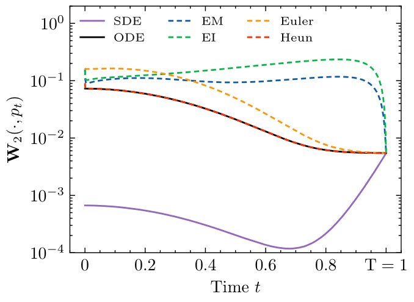
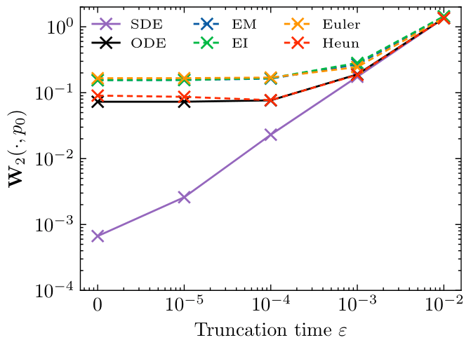
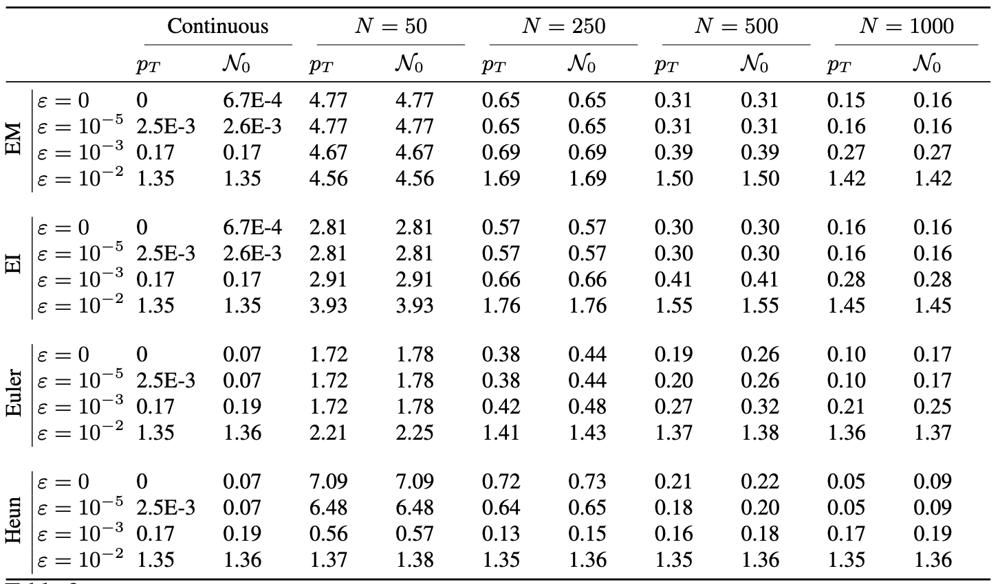

## Diffusion models for Gaussian distributions: Exact solutions and Wasserstein errors

The following code provides figures and table of the preprint  *Diffusion models for Gaussian distributions: Exact solutions and Wasserstein errors. (2024).* You can use it with your own scheme and data.

The code reproduces Figure 1 with the following graphs

 

and gives also the tex source to generate Table 2 of the article which is:

## Usage

- You can plot the figures and tables corresponding to the preprint by using `Gaussian_diffusion_W2.ipynb` and the data `ADSN.npy` and `cifar10.npy`. To observe the code online, we suggest to open `Gaussian_diffusion_W2.pdf` to avoid latex compilation errors.
- You can use your own data and pre-process the eigenvalues of the covariance matrix of the associated Gaussian distribution by using  `vps_ADSN.ipynb` for an ADSN and `vps_Gaussian_cifar10.ipynb` for a dataset of images.

